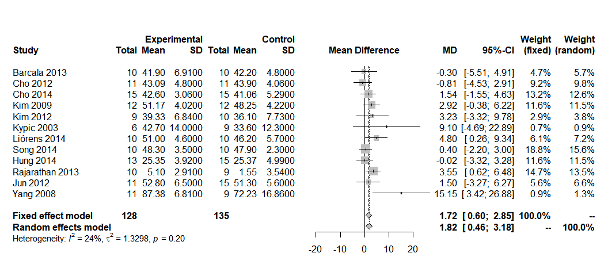

Forest Plot
================

## A técnica

As gráficos Forest plot são importantes nas meta-análises utilizadas
para mostrar resultados de estudos individuais e análises agrupadas, são
fáceis e simples de compreender porque fornecem informação tabular e
gráfica sobre estimativas de comparações ou associações, correspondente
precisão e significado estatístico. Esta representação visual também
facilita a visualização de variações entre os resultados de estudos
individuais.

## O código

Carregando o pacote, se for a primeira vez que roda o pacote será
necessário instalá-lo também.

``` r
library(meta)
```

    ## Loading 'meta' package (version 4.15-1).
    ## Type 'help(meta)' for a brief overview.

## Carga dos dados

É possível carregar os estudos por planilha diretamente no R ou por
script como segue:

``` r
estudo<-c("Barcala 2013","Cho 2012", "Cho 2014", "Kim 2009", "Kim 2012", "Kypic 2003", "Liórens 2014", "Song 2014", "Hung 2014", "Rajarathan 2013", "Jun 2012", "Yang 2008")
nu_experimental<-c(10, 11, 15, 12, 9, 6, 10, 10, 13, 10, 11, 11)
me_experimental<-c(41.9, 43.09, 42.6, 51.17, 39.33, 42.7, 51, 48.3, 25.35, 5.1, 52.8, 87.38)
sd_experimental<-c(6.91, 4.8, 3.06, 4.02, 6.84, 14, 4.6, 3.5, 3.92, 2.91, 6.5, 6.81)
nu_controle<-c(10, 11, 15, 12, 10, 9, 10, 10, 15, 9, 15, 9)
me_controle<-c(42.2, 43.9, 41.06, 48.25, 36.1, 33.6, 46.2, 47.9, 25.37, 1.55, 51.3, 72.23)
sd_controle<-c(4.8, 4.06, 5.29, 4.22, 7.73, 12.3, 5.7, 2.3, 4.99, 3.54, 5.6, 16.86)
subgrupo<-c("BBS","BBS","BBS","BBS","BBS","BBS","BBS","BBS","FRT","FRT","ABC","ABC")

data <-data.frame(estudo, nu_experimental, me_experimental, nu_controle, me_controle, sd_controle, subgrupo)
```

## Visão dos estudos carregados

No exemplo foram carregados 12 estudos

| estudo          | nu\_experimental | me\_experimental | nu\_controle | me\_controle | sd\_controle | subgrupo |
| :-------------- | ---------------: | ---------------: | -----------: | -----------: | -----------: | :------- |
| Barcala 2013    |               10 |            41.90 |           10 |        42.20 |         4.80 | BBS      |
| Cho 2012        |               11 |            43.09 |           11 |        43.90 |         4.06 | BBS      |
| Cho 2014        |               15 |            42.60 |           15 |        41.06 |         5.29 | BBS      |
| Kim 2009        |               12 |            51.17 |           12 |        48.25 |         4.22 | BBS      |
| Kim 2012        |                9 |            39.33 |           10 |        36.10 |         7.73 | BBS      |
| Kypic 2003      |                6 |            42.70 |            9 |        33.60 |        12.30 | BBS      |
| Liórens 2014    |               10 |            51.00 |           10 |        46.20 |         5.70 | BBS      |
| Song 2014       |               10 |            48.30 |           10 |        47.90 |         2.30 | BBS      |
| Hung 2014       |               13 |            25.35 |           15 |        25.37 |         4.99 | FRT      |
| Rajarathan 2013 |               10 |             5.10 |            9 |         1.55 |         3.54 | FRT      |
| Jun 2012        |               11 |            52.80 |           15 |        51.30 |         5.60 | ABC      |
| Yang 2008       |               11 |            87.38 |            9 |        72.23 |        16.86 | ABC      |

## Carga e gráfico gerado

``` r
rvmeta <- metacont(nu_experimental, me_experimental, sd_experimental, nu_controle, me_controle, sd_controle, estudo, data)
forest(rvmeta) 
```

<!-- -->

## Como interpretar o gráfico


## Referências

Easy Knowledge Treinamentos - Como Fazer uma metaanálise no R.
Disponível em:
<https://www.youtube.com/watch?v=_s7XgzgWuPY&ab_channel=Easy-knowledgetreinamentos>

LI, Guowei; ZENG, Jie; TIAN, Junzhang; LEVINE, Mitchell A. H.; THABANE,
Lehana. Multiple uses of forest plots in presenting analysis results in
health research. \[s.l.\] : Elsevier Inc., 2020. v. 117 DOI:
10.1016/j.jclinepi.2019.09.021. Disponível em:
<https://doi.org/10.1016/j.jclinepi.2019.09.021>.

SCHWARZER, Guido. General Package por Meta-Analysis - Package ‘meta’.
Disponível em: <https://cran.r-project.org/web/packages/meta/meta.pdf>

### Outras referências de interesse

O trabalho do pesquisador Daniel Quintana, da Universidade de Oslo,
apresenta um passo a passo para o uso do R com o pacote “metaphor” bem
completo. Há um tutorial em inglês disponível em:
<https://www.youtube.com/watch?v=d1pYHfCKhyA&app=desktop&ab_channel=DanielQuintana>
e a referência de seu trabalho é a seguinte:

QUINTANA, Daniel S. From pre-registration to publication: A
non-technical primer for conducting a meta-analysis to synthesize
correlational data. Frontiers in Psychology, \[S. l.\], v. 6, n. OCT,
p. 1–9, 2015. DOI: 10.3389/fpsyg.2015.01549.

Já o trabalho de Gener J Aviles-Rodriguez apresenta o pacote “metaviz”,
que também permite meta-análise com muitas variações de gráficos e
análises (Disponível em:
<https://www.rpubs.com/generaviles/metanalysis>)
